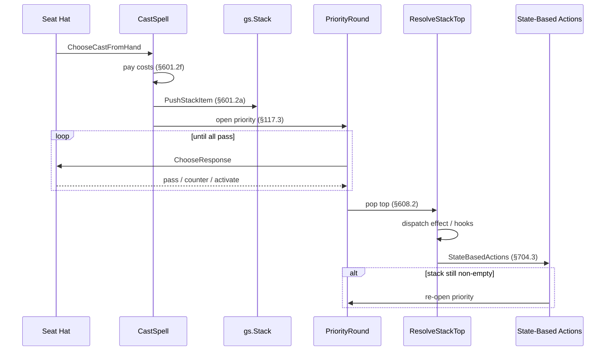

# Stack and Priority

> Last updated: 2026-04-29
> Source: `internal/gameengine/stack.go`, `triggers.go`, `loop_shortcut.go`
> CR refs: §117, §405, §601, §603, §605, §608

Cast pipeline and resolution loop. LIFO stack, [APNAP-ordered](APNAP.md) triggers, [mana abilities](Mana%20System.md) exempt.

## Cast → Resolve Sequence

## Key Functions

- `CastSpell(gs, seat, card, targets)` — full §601.2 sequence
- `PushStackItem(gs, item)` — allocate ID, append, log to [Tool - Stack Trace](Tool%20-%20Stack%20Trace.md)
- `PushTriggeredAbility(gs, src, effect)` — §603.2 trigger landing
- `PriorityRound(gs)` — §117.3-5 APNAP polling, capped at 8 iterations
- `ResolveStackTop(gs)` — §608.2 pop + dispatch
- `DrainStack(gs)` — wraps the resolve loop with safety caps

## Safety Caps

| Cap | Value | Reason |
|---|---|---|
| `maxStackDrainIterations` | 500 | cascading triggers (Storm, Cascade) |
| `maxDrainRecursion` | 10 | recursive `CastSpell → DrainStack` |
| `maxResolveDepth` | 50 | reanimate/sacrifice Go call-stack overflow |
| Trigger guard depth | 8 per chain | per-card trigger storms |
| Trigger guard total | 2000 per game | cumulative cap |

## Loop Shortcut (CR §727)

`loop_shortcut.go` detects repeating fingerprints (FNV hash of source+controller+kind), projects per-cycle delta forward to termination. Catches Kinnan-token loops, Ashling-counter loops without timeout. See [Trigger Dispatch](Trigger%20Dispatch.md) for trigger-loop interplay.

## Mana Abilities Exempt (§605.3a)

Mana abilities resolve inline, never pushed. `isManaAbilityEvent()` gates this in `activation.go`.

## APNAP Ordering

Simultaneous triggers grouped by controller, sorted by [APNAP](APNAP.md) (active player first onto stack → resolves last). Within a controller, [the hat](Hat%20AI%20System.md) picks intra-group order via `OrderTriggers`. See [Trigger Dispatch](Trigger%20Dispatch.md).

## Related

- [State-Based Actions](State-Based%20Actions.md)
- [Combat Phases](Combat%20Phases.md)
- [Trigger Dispatch](Trigger%20Dispatch.md)
- [Tool - Stack Trace](Tool%20-%20Stack%20Trace.md)
