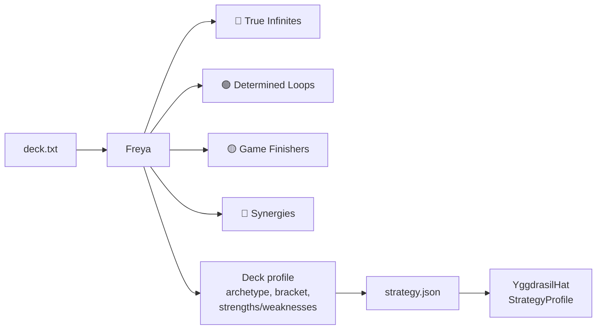

# Tool - Freya

> Last updated: 2026-04-29
> Source: `cmd/mtgsquad-freya/`

Combo and synergy detector. Output drives [YggdrasilHat](YggdrasilHat.md) strategy. Full pipeline detail in [Freya Strategy Analyzer](Freya%20Strategy%20Analyzer.md) — this note is the at-a-glance entry point.

## At a Glance



## Usage

```bash
go run ./cmd/mtgsquad-freya --deck data/decks/benched/ragost.txt
go run ./cmd/mtgsquad-freya --all-decks data/decks/lyon/ --format markdown
go run ./cmd/mtgsquad-freya --deck my_deck.txt --format json
```

## Outputs

- Console / markdown / JSON depending on `--format`
- `<deck>.strategy.json` — consumed by [hats](Hat%20AI%20System.md)
- `<deck>_freya.md` — human-readable summary

## Pipeline

5 phases — see [Freya Strategy Analyzer](Freya%20Strategy%20Analyzer.md) for full detail:

1. Statistics (mana curve, color sources, Karsten land eval)
2. Roles (12 tags per card)
3. Archetype (10-archetype Euclidean match)
4. Win lines (tutor chains, redundancy, single points of failure)
5. Profile (unified `DeckProfile` struct)

## Known Bugs

False-positive loops — see false-positive pattern for self-exile, hand-vs-battlefield, attack-trigger, and randomness causes.

## Related

- [Freya Strategy Analyzer](Freya%20Strategy%20Analyzer.md)
- [Hat AI System](Hat%20AI%20System.md)
- [YggdrasilHat](YggdrasilHat.md)
