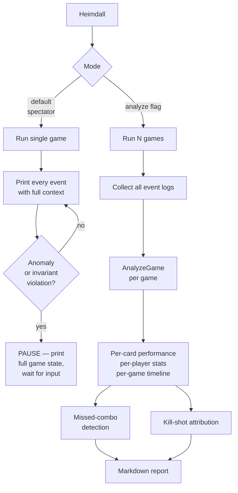

# Tool - Heimdall

> Source: `cmd/mtgsquad-heimdall/`, `internal/analytics/`

Heimdall is HexDek's analytics engine. Two modes: **spectator** (live single-game stream with pause-on-anomaly) and **analytics** (post-tournament deep report).

## Two Modes



## What Heimdall Tracks

- **Per-card performance** — times played, kills attributed, triggers fired
- **Win-condition detection** — lethal-threshold kill-shot identification
- **Mana efficiency** — wasted mana from pool drains
- **Dead-card analysis** — cards stuck in hand all game (suggests cuts)
- **Matchup matrices** — commander vs commander winrates
- **Missed combo detection** — flags when a known combo was live but not executed (a hat failure)

## Known Combos Tracked

`internal/analytics/combos.go::KnownCombos` lists 10 combos that the analyzer cross-references against game state at every snapshot. If both pieces are on the battlefield + controller has priority + game continues without combo execution, the missed-combo counter increments.

| Combo | Pieces |
|---|---|
| Thoracle line | Thassa's Oracle + Demonic Consultation / Tainted Pact |
| Ragost loop | Ragost commander + sacrifice outlet |
| Sanguine loop | Sanguine Bond + Exquisite Blood |
| Basalt + Kinnan | Basalt Monolith + Kinnan |
| Isochron + Reversal | Isochron Scepter + Dramatic Reversal |
| Ballista + Heliod | Walking Ballista + Heliod, Sun-Crowned |
| Aetherflux Storm | Aetherflux Reservoir + storm |
| Dockside + Sabertooth | Dockside Extortionist + Temur Sabertooth |
| Food Chain | Food Chain + eternal creature |
| Altar + Gravecrawler | Phyrexian Altar + Gravecrawler |

These are explicitly enumerated because heuristic combo recognition is too noisy (false positives). Hand-curated list = high precision.

## Spectator Mode

Default mode. Runs one game and streams every event with full context. Useful for:

- Watching a Discord showmatch live
- Debugging a specific game ("why did Yuriko win that pod?")
- Educational demos — every action is annotated with rule citation

`--pause-on-anomaly` halts on the first invariant violation or unexpected event, printing the full state for inspection.

## Analytics Mode

`--analyze --games N` runs N games, collects all event logs, and produces a markdown report:

- Per-card stats table (sorted by usage frequency)
- Per-commander winrate table
- Matchup matrix (commander × commander)
- Missed-combo table (which combos went unexecuted)
- Kill-shot attribution (which card or interaction landed the killing blow)

## Discord Showmatch Hook

`TakeTurnWithHook` (in `internal/tournament/turn.go`) gives Heimdall a per-phase snapshot callback. The showmatch spectator loop uses this for paced Discord narration — every phase boundary triggers a snapshot, snapshot gets formatted as a Discord message, message gets posted with a small delay so humans can follow along.

## Usage

```bash
# Spectator
go run ./cmd/mtgsquad-heimdall \
  --decks data/decks/cage_match \
  --seed 42 \
  --pause-on-anomaly

# Analytics
go run ./cmd/mtgsquad-heimdall \
  --analyze --games 50 --decks data/decks/cage_match \
  --hat poker --report data/rules/HEIMDALL_ANALYSIS.md
```

## When You'd Use Heimdall

- **After a tournament run** — read the per-card stats to identify dead cards
- **Showmatch broadcasting** — spectator mode for live narration
- **Bug triage** — `--pause-on-anomaly` halts on first weird thing for inspection
- **Hat regression check** — missed-combo counter tells you if Yggdrasil started missing combos it used to find

## Related

- [Tool - Tournament](Tool%20-%20Tournament.md) — produces the event logs Heimdall consumes
- [Tool - Freya](Tool%20-%20Freya.md) — strategy intelligence Heimdall cross-references
- [Engine Architecture](Engine%20Architecture.md) — event log spec
