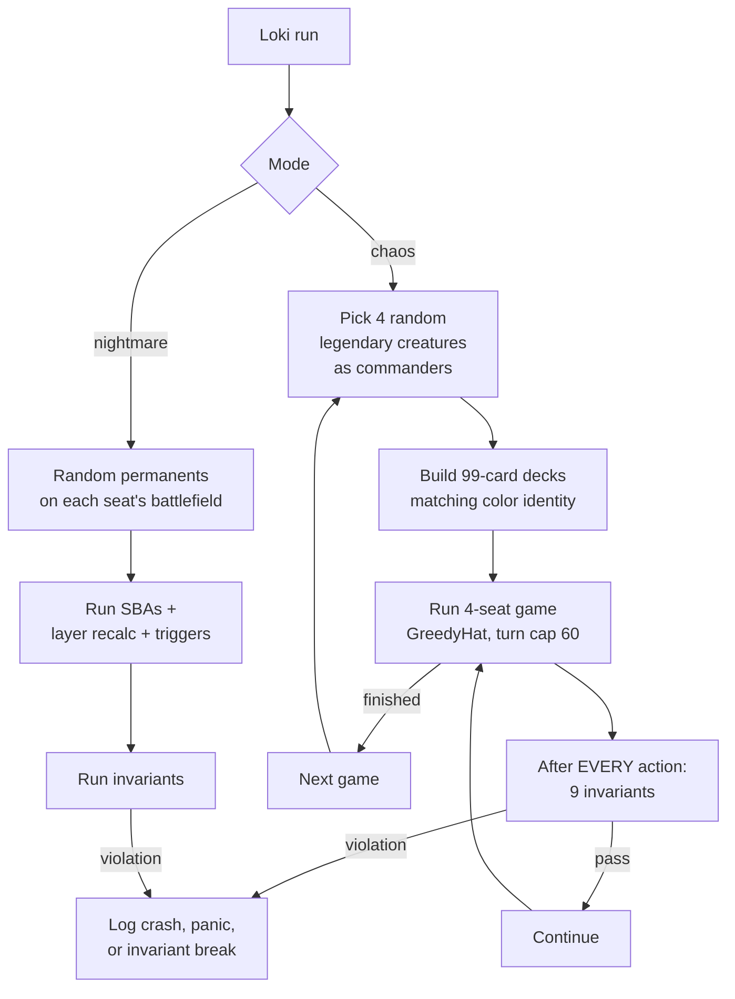

# Tool - Loki

> Source: `cmd/mtgsquad-loki/`
> Status: Production. 10K games + 50K nightmare boards = ZERO violations.

Loki is the chaos gauntlet. It picks 4 random commanders from the full 36K corpus, builds 99-card decks matching their color identity, runs 4-seat games, and checks the 20 [Odin invariants](Invariants%20Odin.md) after every action. The point is to catch "card combinations nobody designed test cases for" — bugs that only surface when specific real cards interact.

## Why Random Decks

[Thor](Tool%20-%20Thor.md) is exhaustive but per-card. Each card gets every interaction in isolation. That misses bugs caused by *combinations* of cards. Real Magic decks are 99 cards drawn from 30K+ candidates — there are far too many possible combinations to enumerate. Loki samples instead: random pods, real games, real interactions.

The trick is using the **full corpus**, not just a curated test set. A pod of "Sliver Queen + Goblin Sharpshooter + Najeela + The Locust God" is something no human would build but the engine has to handle gracefully when random sampling produces it.

## Run Loop



## Modes

### Chaos Games

Full game simulation with random decks. Tests the engine under realistic stress.

### Nightmare Boards

Static random board state — populate each seat's battlefield with N random permanents, then run SBAs + layer recalc + triggers. Tests [Layer System](Layer%20System.md) and [State-Based Actions](State-Based%20Actions.md) against permanent combinations no test designed for.

This catches a different bug class than chaos games. Chaos games test "during a real game, do interactions work?" Nightmare boards test "given an arbitrary legal board state, do continuous effects + layers + SBAs reach a stable point?"

## Permutations Flag

`--permutations N` runs N games per random deck set with different shuffles. Catches "this card *combination* breaks things" not just "this *shuffle* breaks things." A combination bug surfaces consistently across permutations; a shuffle-specific issue (single bad seed) shows up once.

## Usage

```bash
# Standard chaos run
go run ./cmd/mtgsquad-loki --games 10000 --workers 8

# Combine chaos + nightmare boards
go run ./cmd/mtgsquad-loki --games 5000 --nightmare-boards 50000

# Reproducible seed + permutations
go run ./cmd/mtgsquad-loki --games 1000 --seed 42 --permutations 5
```

Output is per-violation: card list, action sequence, invariant name, game ID, full state snapshot. Designed for next-morning triage.

## When You'd Use Loki

- **Continuous integration** — overnight runs catch regressions across the full corpus
- **After a major engine change** — verify the change doesn't break exotic interactions
- **As a bug-source for [Judge](Tool%20-%20Judge.md)** — Loki finds the bug, Judge reproduces it deterministically

## Sunset Plan

Per memory (`project_hexdek_parser.md`), [tournament runner --pool mode](Tournament%20Runner.md) is replacing Loki as the primary chaos source. The tournament runner already does random-deck pod assignment from a pool, with the bonus of using [YggdrasilHat](YggdrasilHat.md) instead of GreedyHat — surfaces realistic interactions, not just legal ones.

Loki stays useful for nightmare-board mode and full-corpus randomization, but for chaos games the tournament runner is now preferred.

## Related

- [Tool - Thor](Tool%20-%20Thor.md) — exhaustive per-card counterpart
- [Tool - Odin](Tool%20-%20Odin.md) — overnight fuzzer with violation aggregation
- [Invariants Odin](Invariants%20Odin.md) — the 20 predicates
- [Tool - Tournament](Tool%20-%20Tournament.md) — replacing Loki for chaos play
