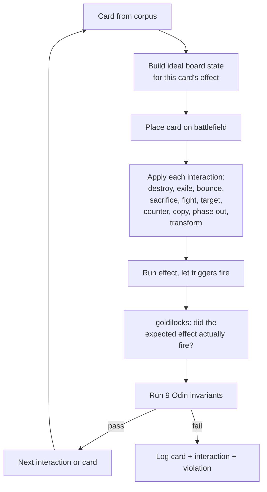

# Tool - Thor

> Source: `cmd/mtgsquad-thor/`
> Status: Production. 793K-541K tests across 36K cards, zero failures.

Thor is HexDek's per-card stress tester. For each card in the corpus, Thor places it on the battlefield, applies every interaction type to it, and verifies the result. Run all 9 [Odin invariants](Invariants%20Odin.md) after each.

## What Thor Does

Thor's core insight: every card has an "ideal" board state where its effect should fire. Place the card there, simulate the effect's expected trigger, and verify the post-state matches expectation. Then run interactions — destroy it, exile it, bounce it, copy it, target it — and verify each interaction handles the card cleanly.

Where [Loki](Tool%20-%20Loki.md) is random chaos, Thor is exhaustive and deterministic. Every card gets every interaction. The output is a surgical hit list: "card X breaks under interaction Y."

## Goldilocks Loop



"Goldilocks" because the test conditions are tuned to be just right — neither too austere (effect can't fire) nor too elaborate (effect succeeds for the wrong reason). The harness builds the minimal board state necessary for the effect to fire, then verifies it does.

## Modules (18+)

Thor isn't one test — it's a suite of test modules each focused on one class of card behavior:

| Module | Purpose |
|---|---|
| `goldilocks` | AST-aware effect verification, oracle-text-aware for keyword variants |
| `spell_resolve` | 7,269 instants/sorceries through stack pipeline |
| `keyword_matrix` | 30×30 keyword combat-pair tests |
| `combo_pairs` | 60 cEDH staples × 60 pair tests |
| `advanced_mechanics` | 145 edge cases, 12 categories |
| `deep_rules` | 100 tests across 20 packs + invariants |
| `claim_verifier` | 60 tests proving coverage-doc claims |
| `negative_legality` | 40 tests verifying illegal action rejection |
| `combo_demo` | Traced combo resolutions |
| `corpus_audit` | Outcome verification across all 31,963 cards |
| `coverage_depth` | 100% functional coverage across 68,944 abilities |
| `oracle_compliance` | Per-card handler oracle compliance |
| `ast_fidelity` | AST round-trip vs oracle text |

## When You'd Use Thor

- **After adding a per-card handler** — make sure goldilocks passes for that specific card
- **After adding an AST node type** — make sure existing card outcomes don't regress
- **Before a tournament run** — verify the corpus is clean (no goldilocks failures)
- **When [Loki](Tool%20-%20Loki.md) finds an invariant violation** — narrow down which card causes it via Thor's deterministic per-card runs

## Usage

```bash
# Full corpus
go run ./cmd/mtgsquad-thor --all

# Single card
go run ./cmd/mtgsquad-thor --card "Blood Artist"

# Specific list
go run ./cmd/mtgsquad-thor --card-list /tmp/my_cards.txt --phases goldilocks

# Parallel + report
go run ./cmd/mtgsquad-thor --workers 10 --report data/rules/THOR_REPORT.md

# Run the corpus audit phases
go run ./cmd/mtgsquad-thor --corpus-audit --coverage-depth --oracle-compliance --ast-fidelity
```

## Difference from Loki

| | Thor | Loki |
|---|---|---|
| Card selection | Every card in corpus | Random subset |
| Interaction selection | Every interaction type | Random sequence in real game |
| Determinism | Deterministic | Seed-driven random |
| Output style | Per-card hit list | Per-game violation log |
| When | Pre-flight before chaos play | Continuous chaos exploration |

Both lean on the same 20 [Odin invariants](Invariants%20Odin.md). Thor finds *card-specific* bugs; Loki finds *combination* bugs.

## Current State (2026-04-28)

- 541K tests, 52 goldilocks failures (effects newly firing — recent additions exposing gaps), 0 panics
- Corpus audit: 100% / 100% / 100% / 100% across all four phases (memory: `project_hexdek_corpus_audit.md`)
- Full suite (`mtgsquad-thor --corpus-audit ...`): 96,159 tests, 0 failures, ~2.2s, ~43K tests/sec

## Related

- [Tool - Loki](Tool%20-%20Loki.md) — chaos counterpart
- [Tool - Odin](Tool%20-%20Odin.md) — overnight invariant fuzzer
- [Invariants Odin](Invariants%20Odin.md) — the 20 predicates
- [Card AST and Parser](Card%20AST%20and%20Parser.md) — what Thor verifies
