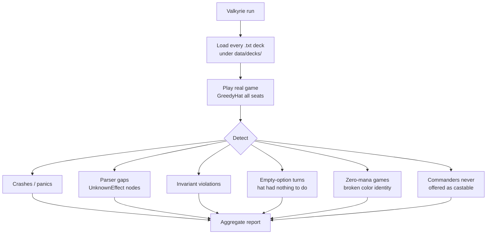

# Tool - Valkyrie

> Last updated: 2026-04-29
> Source: `cmd/mtgsquad-valkyrie/`

Deck regression runner. Loads every saved deck from `data/decks/`, plays real Commander games with [GreedyHat](Greedy%20Hat.md) opponents, reports issues.

## What It Catches



## Why It's Distinct from Loki

- [Loki](Tool%20-%20Loki.md) = random decks, finds invariant violations
- [Thor](Tool%20-%20Thor.md) = exhaustive per-card, finds effect bugs
- **Valkyrie** = real saved decks, finds regressions specific to "decks Josh + 7174n1c actually play" — catches issues that random decks miss because the random decks never assemble that specific cohort

## Usage

```bash
go run ./cmd/mtgsquad-valkyrie
go run ./cmd/mtgsquad-valkyrie --decks data/decks/lyon --games 10
go run ./cmd/mtgsquad-valkyrie --verbose --fail-fast
```

## Output

Per-deck breakdown of failure categories. Designed as a CI smoke test against the curated portfolio (32 decks across 9 folders, see [Engine Overview](Engine%20Overview.md)).

## Related

- [Tool - Loki](Tool%20-%20Loki.md)
- [Tool - Thor](Tool%20-%20Thor.md)
- [Tool - Tournament](Tool%20-%20Tournament.md)
