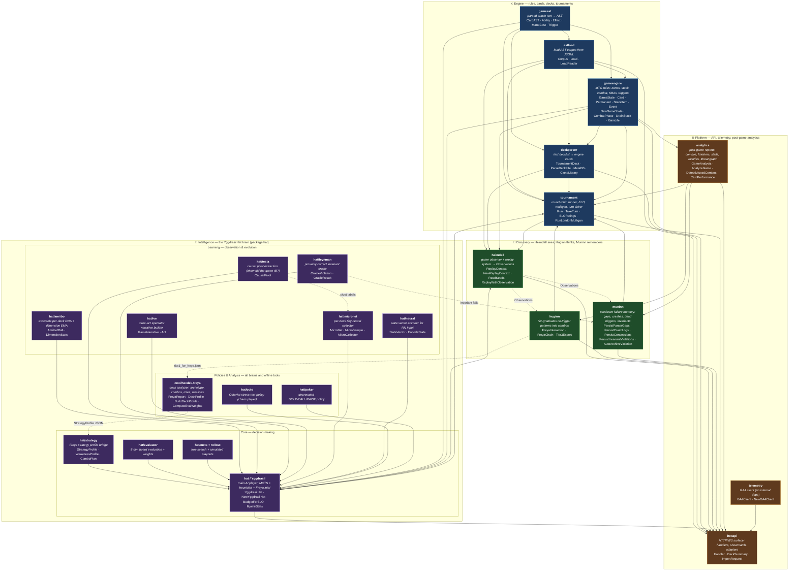

# HexDek System Map

A package-level architecture diagram of the HexDek engine, AI, and platform.
All edges below were extracted from `import` blocks of the actual Go source
files under `internal/` and `cmd/hexdek-freya/`. Sub-modules listed inside
`internal/hat` (Amiibo, Tesla, Feynman, Ive, MicroNet, Octo, Poker, Neural)
are individual `.go` files in `package hat`, not separate packages — they are
shown as nodes for clarity.

## Mermaid graph



## Package summary

### Engine

| Package | One-liner | Imports (internal) |
|---|---|---|
| `gameast` | Parsed oracle text → structured AST (abilities, effects, mana). | — |
| `astload` | Loads JSONL AST corpus into memory. | `gameast` |
| `deckparser` | Decklist text → playable `gameengine.Card` slices, with metadata. | `astload`, `gameast`, `gameengine` |
| `gameengine` | MTG rules engine: zones, stack, combat, SBAs, triggers, mana. | `astload`, `gameast` |
| `tournament` | Tournament runner, ELO, mulligan, turn driver, round-robin/pool. | `analytics`, `astload`, `deckparser`, `gameast`, `gameengine`, `gameengine/per_card`, `hat`, `huginn`, `muninn`, `trueskill` |

### Intelligence (all sub-modules live in `package hat` except Freya)

| Module | One-liner |
|---|---|
| `hat / Yggdrasil` | Main AI player. Layered: heuristic → evaluator → MCTS by budget. |
| `hat/strategy` | `StrategyProfile` — Freya analysis injected into hat decisions. |
| `hat/evaluator` | 8-dim board scoring with archetype-aware weights. |
| `hat/mcts` | Monte Carlo tree search + rollout policies. |
| `hat/amiibo` | Per-deck evolvable DNA; EMA correlations between dim scores and wins. |
| `hat/tesla` | Causal pivot extraction — *when* did the game tilt? |
| `hat/feynman` | Provably-correct invariant oracle (engine-bug detector). |
| `hat/ive` | Three-act narrative builder for spectator UI. |
| `hat/micronet` | Per-deck tiny neural sample collector. |
| `hat/neural` | `StateVector` encoder for NN input. |
| `hat/octo` | OctoHat — chaos stress-test policy. |
| `hat/poker` | Deprecated HOLD/CALL/RAISE adaptive hat. |
| `cmd/hexdek-freya` | Deck analyzer: archetype, combos, roles, win lines, mana base, opening hands. Emits `StrategyProfile` JSON the hat consumes. |

`hat` itself imports only `gameast` and `gameengine`. Freya (`cmd/hexdek-freya`) imports `huginn` to fold tier-3 confirmed combos into `KnownCombos`.

### Discovery (Norse mythology: Heimdall watches, Huginn thinks, Muninn remembers)

| Package | One-liner | Imports (internal) |
|---|---|---|
| `heimdall` | Game observer + deterministic replay system; emits `Observation` records to sinks. | `astload`, `deckparser`, `gameengine`, `hat`, `tournament` |
| `huginn` | Tier-graduates co-trigger pairs (OBSERVED → RECURRING → CONFIRMED) and chains them into N-card lines. | `analytics` |
| `muninn` | Persistent failure memory: parser gaps, crashes, dead triggers, concessions, invariant violations, regressions. | `analytics` |

### Platform

| Package | One-liner | Imports (internal) |
|---|---|---|
| `analytics` | Post-game reports: missed combos/finishers, stall detection, rivalries, threat graph, card rankings. | `gameengine` |
| `telemetry` | GA4 client. No internal dependencies. | — |
| `hexapi` | HTTP/WebSocket surface; bridges every other package to clients. | `analytics`, `astload`, `db`, `deckparser`, `gameengine`, `hat`, `heimdall`, `huginn`, `matchmaking`, `muninn`, `telemetry`, `tournament`, `trueskill`, `versioning` |

## Data flow at a glance

```
Scryfall → thor → ast_dataset.jsonl
                     │
                     ▼
                 astload ──► gameast
                     │           │
                     ▼           ▼
                 deckparser ──► gameengine ──► hat (Yggdrasil)
                                    │              ▲
                                    ▼              │
                                tournament ────────┘
                                    │
                                    ▼
                                analytics
                                ╱   │   ╲
                              ▼     ▼    ▼
                         heimdall huginn muninn
                              │     │     │
                              │     ▼     │
                              │   freya   │
                              │     │     │
                              ▼     ▼     ▼
                                 hexapi  ──► clients (web, spectator)
```

The intelligence loop is deliberately bidirectional: tournament games feed
analytics → huginn graduates patterns → freya consumes tier-3 combos →
freya emits a `StrategyProfile` → hat reads that profile when playing the
next round of tournament games.
