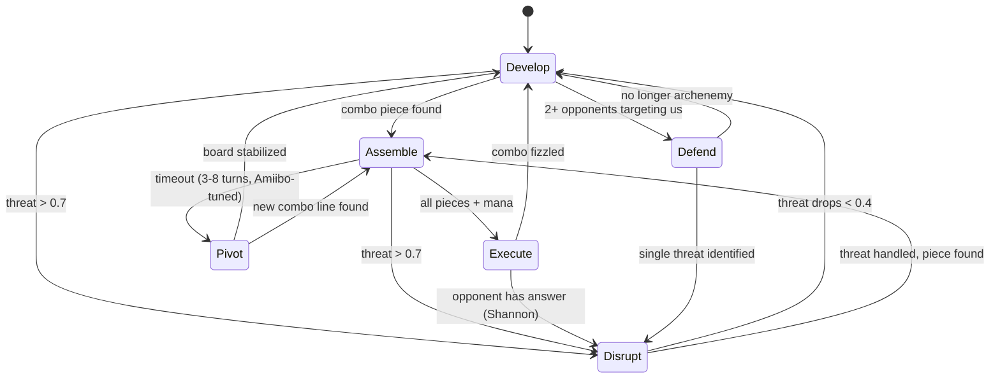

# Hat State Machine

> Source: `internal/hat/gameplan.go` (191 lines), `internal/hat/combo_sequencer.go` (330 lines), `internal/hat/combo_constraint.go` (25 lines)
> Status: **Production** — active in all tournament play

The hat state machine gives YggdrasilHat strategic intent. Instead of evaluating every decision from scratch, the hat maintains a game plan that biases evaluation weights toward the current strategic goal.

## Six Game Plans

```go
type GamePlan int

const (
    PlanDevelop  GamePlan = 0  // default: ramp, build board
    PlanAssemble GamePlan = 1  // combo pieces tracked, prioritize tutors
    PlanExecute  GamePlan = 2  // combo ready, go for the win
    PlanDisrupt  GamePlan = 3  // opponent threatening, hold interaction
    PlanPivot    GamePlan = 4  // primary plan failed, switch to beatdown
    PlanDefend   GamePlan = 5  // archenemy, survive first
)
```

## State Transitions



The state machine ticks once per turn (upkeep). `PlanState.Evaluate()` checks transitions in priority order:

1. Execute if combo fully assembled
2. Assemble if one piece away
3. Disrupt if any opponent's threat level > 0.7
4. Fizzle back to Develop if combo assessment shows no progress
5. Assemble timeout → Pivot (patience from Amiibo DNA)
6. Reactive plans (Disrupt/Defend) timeout to Develop after 3 turns

## Weight Multipliers

Each plan applies multiplicative biases to the 20 evaluator dimensions:

| Plan | Key boosts | Key suppressions |
|------|-----------|-----------------|
| **Develop** | Mana ×1.5, Card ×1.3, Land ×1.4 | Combo ×0.5 |
| **Assemble** | Combo ×2.0, Tutor ×1.8, Toolbox ×1.5 | Board ×0.6 |
| **Execute** | Combo ×2.5, Stack ×1.5 | Board ×0.3, Card ×0.3 |
| **Disrupt** | Stack ×2.0, Threat ×1.8 | Combo ×0.5 |
| **Pivot** | Board ×1.6, Activation ×1.4 | Combo ×0.3 |
| **Defend** | Life ×2.0, Board ×1.5, Stack ×1.5 | Combo ×0.2 |

These multipliers are applied as the final layer in `rescaleWeights()`, after stage scaling and position scaling.

## Combo Sequencer

The combo sequencer is the input that drives Assemble → Execute transitions. It evaluates all combo lines defined in the deck's Freya strategy profile.

### Combo Constraint

```go
type ComboConstraint struct {
    Name           string
    PiecesNeeded   []string
    ZonesAccepted  map[string][]string  // piece → acceptable zones
    ManaRequired   int
    SequenceOrder  []string             // cast order
    NeedsProtection bool               // infinite combos auto-flagged
}
```

### Assessment

```go
type ComboAssessment struct {
    Executable   bool              // all pieces in position + mana available
    Assembling   bool              // 1 piece short + tutor in hand
    BestLine     *ComboConstraint
    NextAction   string            // what to cast/tutor for next
    MissingPiece string
    PiecesFound  int
    PiecesTotal  int
}
```

`Evaluate()` scans all combo lines, builds a zone index (hand/battlefield/graveyard), checks available mana, and returns the best line. Priority: executable > higher completion ratio > fewer total pieces.

### Tutor Detection

`hasTutorInHand()` checks both oracle text patterns ("search your library") and AST `isTutor()` classification. When assembling with 1 piece missing and a tutor in hand, the hat knows to fetch the missing piece.

## Assemble Timeout

```go
func (ps *PlanState) assembleTimeout() int
```

Returns 3–8 turns, modulated by `ComboPatience` from Amiibo DNA. Aggressive Amiibos pivot away from stalled combos faster; patient ones hold the line longer. Default is 5 turns when ComboPatience is 0.

## Integration

- `PlanState.Evaluate()` called from `YggdrasilHat.ObserveEvent()` on each upkeep
- `ComboAssessment` input from `ComboSequencer.Evaluate()`
- `threatLevel` input from `assessAllThreats()`
- Multipliers applied to `GameStateEvaluator.PlanMultiplier`
- Shannon entropy can delay Execute → combo blocked if `opponentLikelyHasAnswer()`

## Related Docs

- [YggdrasilHat](YggdrasilHat.md) — parent system
- [Eval Weights and Archetypes](Eval%20Weights%20and%20Archetypes.md) — weights being multiplied
- [Genetic Amiibo](Genetic%20Amiibo.md) — tunes ComboPatience
- [Shannon Entropy](Shannon%20Entropy.md) — gates Execute decisions
