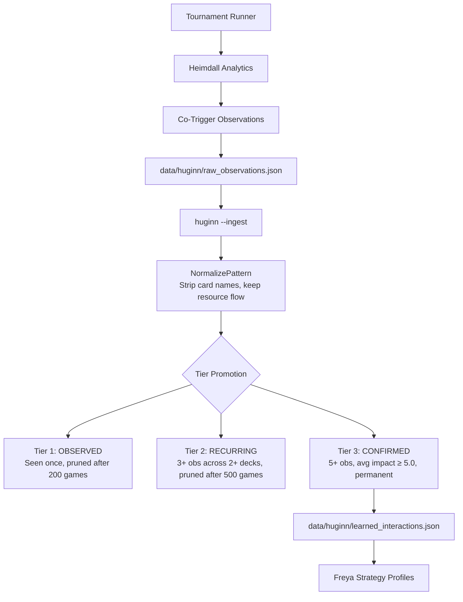

# Tool - Huginn

> Source: `cmd/hexdek-huginn/` + `internal/huginn/`
> Status: Production. Runs as post-tournament ingest step.

Huginn is HexDek's emergent interaction discovery system. Named after Odin's raven of thought, it watches what happens during tournament games and learns which card combinations produce meaningful synergies — without anyone having to hardcode them.

The core insight: when [Heimdall](Tool%20-%20Heimdall.md) observes two cards triggering in sequence and the game state shifts significantly, that's a signal. One observation is noise. Three across different decks is a pattern. Five with consistent high impact is a confirmed interaction that [Freya](Tool%20-%20Freya.md) should know about.

## How It Works



## Tier Lifecycle

| Tier | Name | Requirements | Pruning |
|------|------|-------------|---------|
| 1 | OBSERVED | Seen once | Pruned after 200 games without recurrence |
| 2 | RECURRING | 3+ observations across 2+ unique decks | Pruned after 500 games without recurrence |
| 3 | CONFIRMED | 5+ observations, average impact score ≥ 5.0 | Permanent — never pruned |

Tiers only promote, never demote. A cap of 500 entries on combined tier 1+2 prevents unbounded growth; overflow is sorted by total impact and the lowest are dropped.

## Pattern Normalization

Raw observations contain card names: "Sol Ring produces mana, Thrasios consumes mana". Huginn strips the card names and keeps only the resource flow: `produces mana → consumes mana`. This compression means one pattern can match across many card pairs, accelerating tier promotion.

## CLI Usage

```bash
hexdek-huginn                           # default: --stats + --list
hexdek-huginn --ingest                  # process new raw observations
hexdek-huginn --ingest --games-since 50 # ingest with aging (50 games since last run)
hexdek-huginn --list --top 10           # show top 10 per tier
hexdek-huginn --candidates              # show tier 3 confirmed interactions
hexdek-huginn --stats                   # summary counts per tier
hexdek-huginn --prune                   # garbage collect stale tier 1-2
hexdek-huginn --dir data/huginn         # custom data directory
```

## Data Files

| File | Format | Purpose |
|------|--------|---------|
| `data/huginn/raw_observations.json` | Append-only JSON array | Raw co-trigger observations from Heimdall |
| `data/huginn/learned_interactions.json` | Sorted JSON array | Graduated interaction patterns by tier |

## Integration Points

- **Input**: [Heimdall](Tool%20-%20Heimdall.md) produces `CoTriggerObservation` records during game analysis
- **Output**: Learned tier 3 interactions feed into [Freya](Tool%20-%20Freya.md) for strategy profile augmentation
- **Persistence**: Atomic file writes via temp-file + rename (safe across sequential tournament runs)
- **Sibling**: [Muninn](Tool%20-%20Muninn.md) handles the other half of persistent memory (parser gaps, crashes, dead triggers)

## Related

- [Muninn](Tool%20-%20Muninn.md) — Odin's other raven (memory)
- [Heimdall](Tool%20-%20Heimdall.md) — Source of co-trigger observations
- [Freya](Tool%20-%20Freya.md) — Consumer of confirmed interactions
- [Tool Suite](Tool%20Suite.md) — Full tool reference
