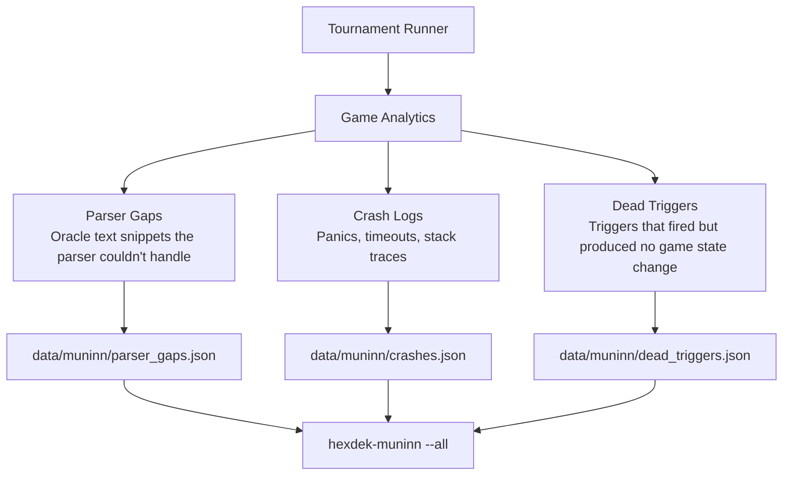

# Tool - Muninn

> Source: `cmd/hexdek-muninn/` + `internal/muninn/`
> Status: Production. Runs as post-tournament persist step. Tested (`muninn_test.go`).

Muninn is HexDek's persistent memory system. Named after Odin's raven of memory, it accumulates parser gaps, crash logs, and dead triggers across tournament runs as append-only JSON files on disk. Where [Huginn](Tool%20-%20Huginn.md) learns what cards *do together*, Muninn remembers what *went wrong*.

The design is deliberately simple: append-only JSON, atomic writes, no database. Tournament runners call the persist functions after each batch, and the data survives restarts, crashes, and code updates. The CLI reads it back as human-readable reports.

## What It Tracks



### Parser Gaps

Snippets of oracle text the parser couldn't fully resolve into AST nodes. Deduplicated by snippet text, count incremented on recurrence. High-count gaps are the highest priority parser improvements.

### Crash Logs

Panics and timeouts during tournament games. Each entry includes the stack trace, the decks involved, game configuration, and turn count. Sorted by recency for triage.

### Dead Triggers

Triggers that fired (TriggeredCount > 0) but produced no measurable game state change — no damage dealt, no kills attributed, not the winning card. These are "wired but dead" and indicate either a handler bug or a trigger that needs filtering. Excludes lands and tokens.

## CLI Usage

```bash
hexdek-muninn                           # default: --all
hexdek-muninn --gaps                    # parser gaps only
hexdek-muninn --crashes                 # crash logs only
hexdek-muninn --triggers                # dead triggers only
hexdek-muninn --all --top 50            # all sections, top 50 per section
hexdek-muninn --dir data/muninn         # custom data directory
```

## Data Files

| File | Format | Purpose |
|------|--------|---------|
| `data/muninn/parser_gaps.json` | Merged JSON array | Parser gap snippets with count, first/last seen |
| `data/muninn/crashes.json` | Append-only JSON array | Crash entries with stack traces and context |
| `data/muninn/dead_triggers.json` | Merged JSON array | Dead triggers with count, games seen |

## Persistence Model

All persist functions follow the same pattern:

1. Read existing file (empty array if missing)
2. Merge new data (deduplicate by key, increment counts, update timestamps)
3. Write to temp file
4. Atomic rename to target path

This is safe for concurrent sequential tournament runs — no partial writes, no corruption. The `atomicWriteJSON` helper handles the temp-file + rename pattern.

## Integration Points

- **Input**: Tournament runner calls `PersistParserGaps()`, `PersistCrashLogs()`, `PersistDeadTriggers()` after each batch
- **Consumers**: CLI for human review, potential future integration with [Odin](Tool%20-%20Odin.md) for automated gap → handler graduation
- **Sibling**: [Huginn](Tool%20-%20Huginn.md) handles the other half of persistent memory (learned interactions)

## Related

- [Huginn](Tool%20-%20Huginn.md) — Odin's other raven (thought)
- [Tool Suite](Tool%20Suite.md) — Full tool reference
