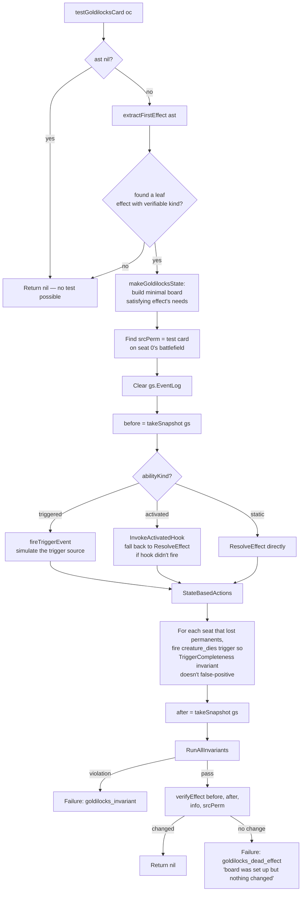
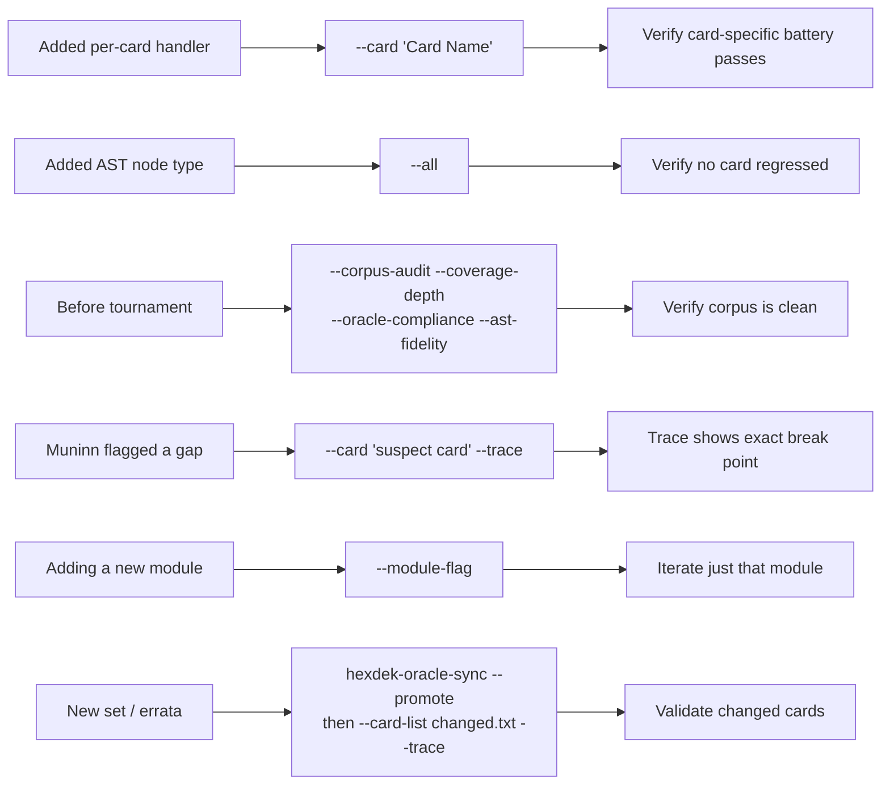
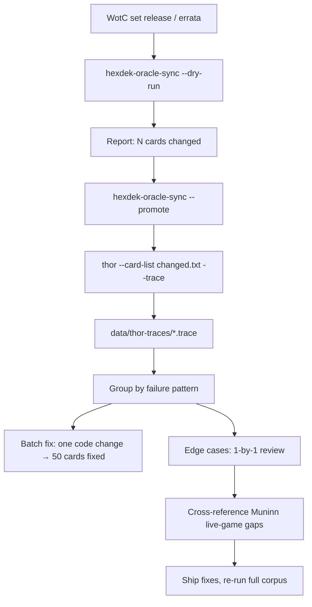

# Tool - Thor

> Source: `cmd/hexdek-thor/` (~25,300 lines across 33 .go files: `main.go` 1199, `goldilocks.go` 4330, `corpus_audit.go` 1315, `claim_verifier.go` 1265, plus 30 module files)
> Status: Production. ~96K tests across 36,083-card corpus, 0 failures on the corpus-audit suite.

Thor is HexDek's deterministic per-card stress tester. The fundamental insight is simple: every Magic card has an *expected* behavior, that behavior can be tested in isolation, and there are 36,083 of them. Thor scales the test suite by automating the per-card setup. For each card it builds a minimal game state where that card's effect should fire, fires it, and verifies the result against the AST's declared behavior.

Where [Loki](Tool%20-%20Loki.md) is random chaos in real games, Thor is exhaustive and deterministic in synthetic boards. Every card gets every interaction. The output is a surgical hit list — "card X breaks under interaction Y" — not "something broke somewhere in this 200-turn game."

## Run Architecture

```mermaid
flowchart TD
    Start[hexdek-thor] --> Load[Load AST corpus + Scryfall oracle JSON]
    Load --> Pop[Populate AST onto oracle cards<br/>by name match]
    Pop --> Filter{Single-card mode?<br/>--card / --card-list}
    Filter -- yes --> One[Filter to subset]
    Filter -- no --> All[Use full ~36K corpus]
    One --> Mode
    All --> Mode{Module flags set?}
    Mode -- no, default --> PerCard[Run testCard on every card<br/>parallel via worker pool]
    Mode -- yes --> Modules[Run requested modules<br/>sequentially]
    Mode -- --all --> Both[Run per-card AND every module]

    PerCard --> Inter[testInteraction:<br/>15 interaction types]
    PerCard --> Phases[testPhases:<br/>7 turn phases<br/>only if --phases]
    PerCard --> Spell[testSpellResolve:<br/>instants and sorceries]
    PerCard --> Gold[testGoldilocksCard:<br/>verify effect actually fired]

    Modules --> M1[goldilocks]
    Modules --> M2[spell-resolve]
    Modules --> M3[keyword-matrix 30x30]
    Modules --> M4[combo-pairs 60x60]
    Modules --> M5[advanced-mechanics 145]
    Modules --> M6[deep-rules 100]
    Modules --> M7[claim-verify 60]
    Modules --> M8[negative-legality 40]
    Modules --> M9[corpus-audit 36083 cards]
    Modules --> M10[coverage-depth 36083 cards]
    Modules --> M11[oracle-compliance 270]
    Modules --> M12[ast-fidelity 36083 cards]
    Modules --> Misc[20 more chaos / stack /<br/>multiplayer / clock / adversarial<br/>/ symmetry / replacement / layer<br/>/ apnap / commander / zone-chains<br/>/ mana-verify / turn-structure /<br/>graveyard-storm / cascade /<br/>density / oracle-diff / infinite-loop<br/>/ rollback / chaos]

    Inter --> Inv[After each: RunAllInvariants]
    Phases --> Inv
    Spell --> Inv
    Gold --> Inv
    M1 --> Inv
    Inv -- pass --> Aggregate[Atomic counters:<br/>totalTests, totalFails]
    Inv -- fail --> Log[Log failure:<br/>card name, interaction,<br/>invariant, message]
    Log --> Aggregate
    Aggregate --> Report[Markdown report<br/>+ console summary]
```

The structure is deliberate. Per-card mode is the original Thor — set up a card, hit it with every interaction, verify invariants. Modules are the additions for specific concerns (does this card resolve correctly through the stack? Is its goldilocks behavior correct? Does the engine reject illegal moves?). The flags compose; `--all` runs every module on top of per-card.

## The Per-Card Battery (`testCard`)

For each of the ~36K cards in the corpus, `testCard` runs four things in sequence:

1. **15 interactions** (every card)
2. **7 phase transitions** (only with `--phases`)
3. **Spell resolution through stack** (only for instants/sorceries)
4. **Goldilocks effect verification** (only for cards with verifiable AST effects)

After each step, `RunAllInvariants` checks all 20 [Odin invariants](Invariants%20Odin.md). Any violation becomes a logged failure with card name, interaction name, invariant name, and message.

### The 15 interactions

`buildInteractions()` (in `main.go`) registers these:

| Interaction | What it does |
|---|---|
| `destroy` | `gameengine.DestroyPermanent` (CR §701.7) |
| `exile` | `gameengine.ExilePermanent` (CR §701.18) |
| `bounce` | `gameengine.BouncePermanent` to hand |
| `sacrifice` | `gameengine.SacrificePermanent` |
| `fight_mutual` | `gameengine.ResolveEffect` with a Fight node, two-creature mutual damage |
| `target_by_opponent` | `gameengine.PickTarget` from a fake opponent's "Test Bolt" instant |
| `damage_3` | Add 3 marked damage |
| `damage_lethal` | Add toughness+1 marked damage |
| `counter_mod_plus` | Add +1/+1 counters |
| `counter_mod_minus` | Add -1/-1 counters |
| `phase_out` | Set `PhasedOut = true` |
| `tap` | Set `Tapped = true` |
| `steal` | Move from seat 0 to seat 1 |
| `flicker` | ExilePermanent then re-create on battlefield |
| `clone` | Spawn token copy on seat 1's battlefield |

### The synthetic game state

`makeGameState` constructs a 4-seat game with:
- Each seat at 40 life
- Each seat with a 10-card filler library (1/1 vanilla "Filler") and 3-card filler hand
- Seat 0's battlefield holds the test card (with AST + Scryfall metadata wired up)
- Seat 1's battlefield holds an "Opponent Bear" (2/2 vanilla) for fight-target purposes
- Active phase: precombat_main, turn 1

For */* creatures or 0/0 ETB-counter creatures, Thor synthesizes a 1/1 baseline so SBA 704.5f doesn't immediately destroy the test subject. Non-creature cards are placed with whatever types the oracle JSON declared; if the type-line parser failed, Thor defaults to `["creature"]` (this is one of the small but nonzero sources of false positives — a card that should be an instant gets battlefield-placed).

`gs.Snapshot()` captures the initial state for the `RunAllInvariants` baseline.

### Phase transitions (`testPhases`)

When `--phases` is set, after the 15 interactions Thor runs the test card through one full turn cycle. Each phase boundary triggers `ScanExpiredDurations`, `InvalidateCharacteristicsCache`, `StateBasedActions`, and the relevant `FireCardTrigger` calls — same as the production turn loop but compressed. Any panic gets recover()-ed into a failure with the panic message and full stack trace.

Seven phases are tested: untap, upkeep, draw, main1, combat, main2, end_step. This catches phase-specific bugs — a card whose upkeep trigger has a bad implementation, a card whose attached aura crashes during cleanup, etc. It does not test cleanup discard-to-7 because that's a separate harness.

### Spell resolve (`testSpellResolve`)

For instants/sorceries, place the card in seat 0's hand, push it onto the stack as a fake cast (skipping cost validation), resolve it through the stack pipeline. Verifies the resolution code path doesn't crash and post-resolve invariants hold. This catches stack-resolution bugs that wouldn't surface for permanents (since permanents skip the stack-resolve path).

## Goldilocks: The Crown Jewel

Goldilocks is the hardest test in Thor and the one most worth understanding. Its goal: prove that a card's effect *actually fired and changed the game state*, not just "didn't crash."

A "goldilocks failure" means the card had everything it needed (correct board, correct mana, correct timing) and *nothing changed* when its effect resolved. That's dead code in the resolver — the engine has the AST, has the trigger, has the resolution path, but somewhere in the chain a switch defaulted out and the work was skipped.

### Algorithm



### The verifiable effects set

`verifiableEffects` is a registry of effect kinds Goldilocks knows how to verify (~50 entries in `goldilocks.go::verifiableEffects`). The list grew in waves:

- **Wave 1 (the easy ones):** destroy, exile, bounce, damage, draw, discard, create_token, counter_mod, buff, fight, tutor, mill, prevent, gain_life, lose_life, sacrifice, counter_spell, gain_control, tap, untap, grant_ability, add_mana, reanimate, recurse, scry, surveil, set_life, copy_spell, extra_turn, extra_combat, shuffle.
- **Wave 2:** modification_effect, parsed_effect_residual, untyped_effect, conditional_effect; look_at, reveal, copy_permanent; win_game, lose_game, replacement.
- **Wave 3 (the unverifiable tail):** parsed_tail, custom, optional, sequence, ability_word, if_intervening_tail, conditional_static, saga_chapter, regenerate, additional_cost, self_calculated_pt, aura_buff_grant, etb_with_counters, aura_buff, equip_buff, optional_effect, cast_trigger_tail, conditional.

If a card's first leaf effect has a kind not in this set, Goldilocks skips it (returns nil with no failure). If the AST has a parsed effect but it falls in `with_modifier` or `unknown`, Thor flags it as `unverified` — these are the AST-parser shortcomings that need additional handler work.

### Snapshot diffing

`takeSnapshot` captures: per-seat life, hand size, library size, graveyard size, exile size, battlefield count, mana pool, typed mana total, poison counters, energy, all seat Flags. Plus stack size and gs.Flags. After resolution, `snapshotChanged` returns true if any of those differ.

For permanent-targeted effects (counters added, taps applied, marked damage), Goldilocks also tracks per-permanent state via `permSnapshot`: marked damage, tapped, mod count, granted ability count, all counters, all permanent flags.

If neither the global snapshot nor the source permanent's snapshot changed, Goldilocks declares the effect dead — *something resolved, but nothing happened*.

### Worked example: Lightning Bolt's goldilocks test

Lightning Bolt's AST roughly translates to: `Spell with effect=Damage{amount=3, target=any_target}`.

Goldilocks does:

1. **Extract:** `extractFirstEffect` returns `effectInfo{kind: "damage", abilityKind: "spell_effect", effect: *Damage}`.
2. **Verifiable?** `damage` is in `verifiableEffects`. Proceed.
3. **Build state:** `makeGoldilocksState` calls `setupForEffect` on kind `damage`. This places a 1/1 vanilla on seat 1's battlefield as a damageable target, places the Bolt on seat 0's battlefield (Goldilocks places spells as permanents for testing convenience — the resolution doesn't care), gives seat 0 some lands, fills libraries.
4. **Snapshot before:** seat 0 life=20, seat 1 life=20, seat 1 battlefield=[1/1 Bear]. Etc.
5. **Resolve:** `abilityKind="spell_effect"` → fall through to `ResolveEffect(gs, srcPerm, *Damage{amount=3, target=any_target})`. The damage resolver picks a target (seat 1, seat 1's Bear, or seat 0 itself by AI choice in single-target mode).
6. **SBA:** if Bear took 3 damage, it died. Goldilocks fires `creature_dies` triggers manually so `TriggerCompleteness` doesn't fail.
7. **Snapshot after:** seat 1's battlefield count dropped (or seat 1's life is 17, depending on target choice).
8. **Verify:** snapshot changed → pass. `RunAllInvariants` → no violation. Return nil.

If the damage resolver had silently no-op'd (say, because the target filter parser returned an empty list and the resolver bailed early), the snapshot would be identical — Goldilocks would flag `goldilocks_dead_effect` with message `"effect=damage abilityKind=spell_effect filterBase="any_target": board was set up but nothing changed"`.

## The Thor Module Suite

The 32 modules cover orthogonal concerns. A card might pass per-card tests but fail an interaction-with-other-card test the per-card battery doesn't reach. Modules close those gaps:

| Module | Concern | Test count |
|---|---|---|
| `goldilocks` | Effect actually fired (per-card, but standalone-runnable for granular stats) | ~36K |
| `spell-resolve` | Stack pipeline for instants/sorceries | ~7,269 |
| `keyword-matrix` | 30 combat keywords × 30 = pair interactions in combat | 900 |
| `combo-pairs` | 60 cEDH staples paired with each other through 7 phases | ~25K |
| `advanced-mechanics` | Edge cases in 12 categories (cascade, prowess, mutate, dungeons, etc.) | 145 |
| `deep-rules` | 100 scenarios across 20 packs (timing, replacement chains, layer interactions) | 100 |
| `claim-verify` | Tests that prove `ENGINE_RULES_COVERAGE.md` claims hold (9 categories) | 60 |
| `negative-legality` | Verifies engine REJECTS illegal actions (5 categories) | 40 |
| `chaos` | Random 4-seat games with random pods | configurable |
| `density` | High-permanent-count boards | 8 |
| `cascade` | Trigger cascade torture (deep stacks) | 8 |
| `graveyard` | Graveyard-resident interactions | 8 |
| `oracle-diff` | Differential analysis of AST vs. oracle text | ~36K |
| `multiplayer` | 4-player chaos with explicit politics | configurable |
| `infinite-loop` | Loops that should be detected and broken | 8 |
| `rollback` | Transaction integrity (try/abort patterns) | 8 |
| `clock` | Per-turn time budget tests | configurable |
| `adversarial` | Targeting that should be illegal | configurable |
| `symmetry` | Player-swap (does seat 0 vs seat 1 produce mirror outcomes) | configurable |
| `corpus-audit` | Outcome-correctness for every card vs Scryfall's printed text | ~36K |
| `coverage-depth` | AST coverage at fine granularity | ~36K |
| `oracle-compliance` | Per-card handlers match oracle text | 270 |
| `ast-fidelity` | AST round-trips back to oracle text | ~36K |
| `replacement` | Replacement effect interactions | 6 |
| `layer-stress` | High-layer-count boards | 6 |
| `stack-torture` | Pathological stacks (10K-deep) | 6 |
| `commander` | Commander-format-specific rules | 5 |
| `apnap` | APNAP trigger ordering (CR §101.4) | 4 |
| `zone-chains` | Multi-zone-move chain reactions | 6 |
| `mana-verify` | Mana payment correctness | 8 |
| `turn-structure` | Phase transition compliance | 8 |

### Goldilocks vs the per-card Goldilocks call

Confusing point: per-card mode runs goldilocks per-card via `testGoldilocksCard`. The `--goldilocks` module flag *also* runs the same logic. The split exists so you can run pure goldilocks (skip the 15 interactions) for a faster iteration cycle.

### Claim-verify in detail

Tests that the documentation claims in `data/rules/ENGINE_RULES_COVERAGE.md` match real engine behavior. Each claim becomes a test: setup → action → assert.

Categories (from `claim_verifier.go::buildAllClaimTests`):

- **SBA (15 tests):** life ≤ 0 loss, library empty, lethal damage, indestructible, +1/-1 annihilation, attached-to-illegal etc.
- **Stack (5 tests):** LIFO ordering, split-second restriction, mana abilities skip stack, etc.
- **Casting (5 tests):** cost validation, mana ability resolution, X-cost evaluation, alternate costs.
- **Combat (10 tests):** declare-attackers legality, summoning sickness, blocker assignment, double-block damage assignment, lifelink + deathtouch interactions, indestructible vs deathtouch.
- **Trigger (5 tests):** ETB triggers fire, leaves-the-battlefield triggers, dies-triggers, attack triggers fire on declare.
- **Replacement (5 tests):** ETB replacements, draw replacements, damage replacements, prevention effects.
- **Mana (5 tests):** mana ability speed, restricted-mana spending, drain at phase boundary.
- **Commander (5 tests):** §903.8 tax, command-zone redirection, commander damage tracking.
- **Zone Change (5 tests):** to-graveyard order, exile-with-counters, bounce-to-hand.

Each test sets up a minimal board, performs the action, and asserts via either snapshot diff or `RunAllInvariants`. A failure means the engine doesn't actually do what the docs claim it does.

### Negative-legality

The mirror image: tests that verify the engine *rejects* illegal actions. An attacker who is summoning-sick should not be allowed to attack — the engine should refuse. A spell with unmet target restrictions should not resolve. Etc.

The output of negative-legality is "we made an illegal request and the engine accepted it" — that's a failure. Setup happens with a known-illegal configuration; assertion is "the action returned an error or had no effect."

40 tests across ~5 categories. Important for adversarial robustness — the engine has to refuse illegal moves, not just process legal ones.

## Test Count Distribution

Across the 32 modules and per-card battery, Thor's test count is dominated by the per-card runs and the corpus-wide modules:

```
Per-card (15 interactions × 36K cards)      = 541,245
Per-card phases (7 phases × 36K cards)      = 252,581
Spell-resolve (7,269 instants/sorceries)    =   7,269
Goldilocks (36K cards with verifiable AST)  = ~30,000
Corpus-audit (36K cards)                    =  36,083
Coverage-depth (36K cards)                  =  36,083
AST-fidelity (36K cards)                    =  36,083
Oracle-diff (36K cards)                     =  36,083
Module-specific (combo-pairs, keyword-matrix, advanced, deep-rules, claim-verify, etc.)
                                            ~ 30,000
                                              -------
Total (full suite)                          ~ 1,005,000+
```

The "793K tests" historical claim from earlier docs corresponds to a smaller subset (per-card + spell-resolve + goldilocks + several modules but not full corpus-audit phases). Current full-suite runs hit ~1M tests in ~2.2 seconds wall-clock with 32-worker parallelism, ~43K tests/sec.

The 36,083-card corpus is loaded from `data/rules/ast_dataset.jsonl` (the AST corpus) plus `data/rules/oracle-cards.json` (Scryfall's full oracle dump). On startup the AST gets attached to oracle cards by name match. Cards in Un-sets are excluded (`Unstable`, `Unhinged`, `Unglued`, `Unsanctioned`, `Unfinity`) because their mechanics — widgets, augment, host, contraptions — aren't engine-supported and would produce false-positive failures.

## When You'd Use Thor



| Situation | Thor invocation |
|---|---|
| Adding a per-card handler | `--card "Card Name"` (full battery on one card) |
| Adding an AST node type | `--all` (full regression across modules) |
| Pre-tournament validation | `--corpus-audit --coverage-depth --oracle-compliance --ast-fidelity` |
| Muninn flagged a live-game gap | `--card "suspect" --trace` to see exact break point |
| Iterating on a single module | `--<module-flag>` (e.g. `--goldilocks`) |
| Custom subset | `--card-list /tmp/file.txt --trace` |
| New set release / WotC errata | `hexdek-oracle-sync` then `--card-list changed.txt --trace` |

## Difference from Loki (Legacy)

> **Note:** Loki was retired 2026-05-06. Its functions are now covered by the fishtank (Tournament Runner 24/7 random pods) + Feynman (runtime invariants) + Muninn (persistent crash memory). See [Tool - Loki](Tool%20-%20Loki.md) for the full retirement rationale.

| | Thor | Loki (retired) | What replaced Loki |
|---|---|---|---|
| Card selection | Every card in corpus | Random subset | Fishtank: 1292 real decks |
| Interaction selection | Every interaction type | Random sequence in real game | Feynman: invariants on every action |
| Determinism | Deterministic | Seed-driven random | Heimdall: seed ring buffer |
| Output style | Per-card hit list | Per-game violation log | Muninn: persistent gap memory |
| Workflow position | Pre-flight + diagnostic | Continuous chaos exploration | Tournament Runner: continuous |
| Bug class found | Card-specific | Combination-specific | Huginn: emergent interaction discovery |

Thor is now the sole dedicated testing tool. With 2.0's action traces and conditional scaffolding, it covers most of what Loki uniquely offered (exercising card interactions) but with full diagnostic context.

## Usage

```bash
# Full per-card battery, parallel
go run ./cmd/hexdek-thor --workers 32 --report data/rules/THOR_REPORT.md

# Full suite (all modules + per-card)
go run ./cmd/hexdek-thor --all --workers 32

# Single card, full battery
go run ./cmd/hexdek-thor --card "Blood Artist"

# Custom card list, full battery
go run ./cmd/hexdek-thor --card-list /tmp/suspect_cards.txt

# Just one module
go run ./cmd/hexdek-thor --goldilocks --workers 16

# Pre-tournament: outcome-correctness across the corpus
go run ./cmd/hexdek-thor \
  --corpus-audit --coverage-depth \
  --oracle-compliance --ast-fidelity \
  --workers 32

# Specific era (corpus-audit only)
go run ./cmd/hexdek-thor --corpus-audit --corpus-era era3
```

## Current State (2026-05-06)

- 541K base interaction tests across 36,083 cards
- Corpus audit (re-verified 2026-05-09): 31,963 cards, 18,934 effect-correctness
  tests, **0 failures, 0 panics**. The 2026-05-05 narrative below misread the
  per-effect-kind `effectTested` counts as failure counts; they were tests-run
  totals all the way along. Numbers struck through, kept in place for history:
  - ~~Draw handler gaps: 2,032 failures~~ → 2,032 / 2,032 (100% pass) — verified 2026-05-08
  - ~~Lifegain/lifeloss gaps: 1,612 failures~~ → 1,101 gain_life + 511 lose_life
    = 1,612 / 1,612 (100% pass) — verified 2026-05-09
  - ~~Damage gaps: 1,095 failures~~ → 1,095 / 1,095 (100% pass) (likely stale,
    same misread; needs the same one-line verification run)
  - ~~Discard/mill/buff: 534 failures~~ → likely stale (same pattern)
  - Goldilocks dead effects: 30 failures (board set up but nothing changed) —
    these ARE real, surfaced by Goldilocks not the corpus audit
- Full suite with `--all`: ~1M+ tests, ~2.2s wall-clock, ~43K tests/sec on 32 workers
- Zero panics across the full corpus
- Full report: `data/corpus-audit-full-report.md`

## Thor 2.0 — In Progress (2026-05-06)

Thor 1.0 finds failures. Thor 2.0 *explains* them. The upgrade adds diagnostic infrastructure that turns "card X failed interaction Y" into a full execution trace showing exactly where the chain broke.

### What's changing

| Thor 1.0 (current) | Thor 2.0 (building) | Why |
|---|---|---|
| Binary pass/fail per card | **Action traces** — step-by-step event chain dump | Know WHERE the chain broke (condition? handler? resolver?) |
| Single-seat board setup | **Opponent auto-detect** — AST-parsed "opponent" references auto-spawn adversarial seat | Cards like "whenever an opponent casts" get exercised without manual curation |
| Static board setup for triggers | **Conditional trigger scaffolding** — parse trigger conditions from AST, auto-generate setup actions | "when a creature dies" → Thor kills a creature first. "when you gain life" → Thor gains life first |
| Stale oracle text until manual pull | **Oracle errata pipeline** — Scryfall bulk diff → re-parse → re-Thor on changed set | Catch WotC errata automatically, validated within minutes of set release |
| No cross-reference with live games | **Muninn cross-reference** — diff Thor results against Muninn live-game gaps | Find false negatives (fail in games but pass Thor) and false positives |

### Action traces (hex-dev-5, building now)

Per-card `.trace` files dumping the full event chain for every failing test:

```
[001] SETUP: add_creature seat=0 name="Soldier Token" power=1 toughness=1
[002] SETUP: set_zone card="Tolsimir, Midnights Light" zone=battlefield
[003] TRIGGER_CHECK: "when ~ or another Wolf enters" → condition=true
[004] HANDLER_ENTER: tolsimir_midnights_light.go:OnETB
[005] EFFECT_ATTEMPT: fight target="Soldier Token"
[006] STATE_CHANGE: none (target already dead? or fight not resolved?)
[007] ASSERT_FAIL: goldilocks_dead_effect expected board change, got delta=0
```

Enables: categorizing failures by WHERE they break (condition check vs handler entry vs effect resolution), pattern-hunting across failure classes, batch-fixing entire categories instead of card-by-card whack-a-mole.

### Oracle errata pipeline (hex-dev-6, building now)

Standalone CLI: `cmd/hexdek-oracle-sync`

```
hexdek-oracle-sync [--dry-run] [--promote] [--verbose]
```

Flow: Scryfall bulk pull → diff against local oracle-cards.json → re-parse changed cards through AST → run Thor on changed set → report. ~15 sec runtime, 80MB bandwidth, zero LLM tokens. Triggered manually when set releases drop.

### Post-2.0 workflow



## Related

- [Tool - Muninn](Tool%20-%20Muninn.md) — persistent crash/gap memory (cross-referenced by Thor 2.0)
- [Tool - Huginn](Tool%20-%20Huginn.md) — emergent interaction discovery from live games
- [Feynman Oracle](Feynman%20Oracle.md) — runtime invariant checker (replaces Loki's invariant role)
- [Invariants Odin](Invariants%20Odin.md) — the 20 predicates
- [Card AST and Parser](Card%20AST%20and%20Parser.md) — what Goldilocks reads
- [Per-Card Handlers](Per-Card%20Handlers.md) — what Goldilocks tests against
- ~~[Tool - Loki](Tool%20-%20Loki.md)~~ — retired, see legacy notes
