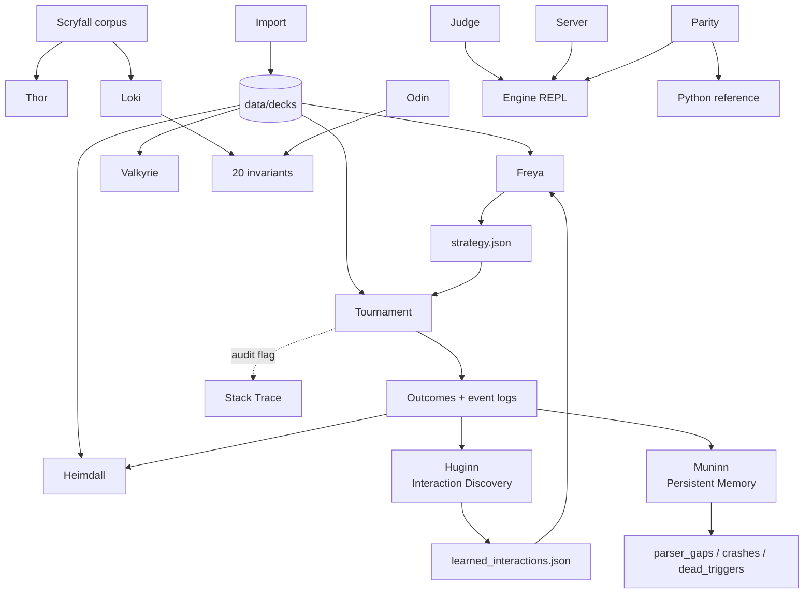

# HexDek Tool Suite — Norse Pantheon

> Last updated: 2026-04-30
> Location: `cmd/`

Norse-named tool suite around the [HexDek engine](Engine%20Architecture.md). Each tool is a single-binary entry point under `cmd/`; shared engine logic lives in `internal/`. Tools split testing, simulation, analysis, and serving into separate processes so each can be parallelized independently and run overnight on DARKSTAR.

## Tools

| Tool | Purpose | Binary |
|---|---|---|
| Thor | Per-card stress tester (oracle-text-aware effect verification) | `cmd/hexdek-thor/` |
| Odin | 20-invariant property fuzzer | `cmd/hexdek-odin/` |
| Loki | Random-deck chaos gauntlet + nightmare boards | `cmd/hexdek-loki/` |
| Heimdall | Spectator + post-game analytics, missed-combo detection | `cmd/hexdek-heimdall/` |
| Freya | Static deck analyzer, archetype + win lines, drives StrategyProfile | `cmd/hexdek-freya/` |
| Valkyrie | Deck regression runner over `data/decks/` | `cmd/hexdek-valkyrie/` |
| Judge | Interactive REPL for adversarial rules testing | `cmd/hexdek-judge/` |
| Tournament | Parallel tournament runner (workhorse) | `cmd/hexdek-tournament/` |
| Server | WebSocket game server for `hexdek.bluefroganalytics.com` | `cmd/hexdek-server/` |
| Import | Single Moxfield/Archidekt URL → `.txt` deck | `cmd/hexdek-import/` |
| Huginn | Emergent interaction discovery (co-trigger → pattern → tier graduation) | `cmd/hexdek-huginn/` |
| Muninn | Persistent crash/gap/dead-trigger memory (append-only telemetry) | `cmd/hexdek-muninn/` |
| Parity | Go ↔ Python engine parity verifier | `cmd/hexdek-parity/` |
| Stack Trace | CR-compliance audit logger (in-engine, not a binary) | `internal/gameengine/stack_trace.go` |

## How They Fit Together



- [Thor](Tool%20-%20Thor.md) verifies cards before they enter chaos play
- [Loki](Tool%20-%20Loki.md) + [Odin](Tool%20-%20Odin.md) both lean on [the same 20 invariants](Invariants%20Odin.md) — Loki for random-deck variety, Odin for overnight fuzz with violation aggregation
- [Freya](Tool%20-%20Freya.md) writes `strategy.json` consumed by [YggdrasilHat](YggdrasilHat.md) inside [Tournament](Tool%20-%20Tournament.md)
- [Heimdall](Tool%20-%20Heimdall.md) reads tournament event logs for analytics + missed-combo detection
- [Valkyrie](Tool%20-%20Valkyrie.md) is the regression smoke test against the curated portfolio
- [Judge](Tool%20-%20Judge.md) reproduces bugs Thor/Loki/Valkyrie surface
- [Server](Tool%20-%20Server.md) hosts the live web frontend
- [Import](Tool%20-%20Import.md) feeds `data/decks/`; [Moxfield Import Pipeline](Moxfield%20Import%20Pipeline.md) handles bulk corpus pulls
- [Huginn](Tool%20-%20Huginn.md) discovers emergent card interactions from Heimdall's co-trigger data, graduates them through 3 confidence tiers, feeds confirmed patterns to Freya
- [Muninn](Tool%20-%20Muninn.md) accumulates parser gaps, crash logs, and dead triggers across tournament runs as append-only persistent memory
- [Parity](Tool%20-%20Parity.md) keeps the Go engine pinned to the Python reference

## Verification Status

```
Thor:   793,826 tests across 36,083 cards — ZERO failures
Loki:   10,000 games + 50,000 nightmare boards — ZERO violations
Odin:   20 invariants checked after every game action
CR Audit: 15/15 identified issues FIXED
```

## Related

- [Engine Overview](Engine%20Overview.md)
- [Engine Architecture](Engine%20Architecture.md)
- [Tournament Runner](Tournament%20Runner.md)
- [Hat AI System](Hat%20AI%20System.md)
