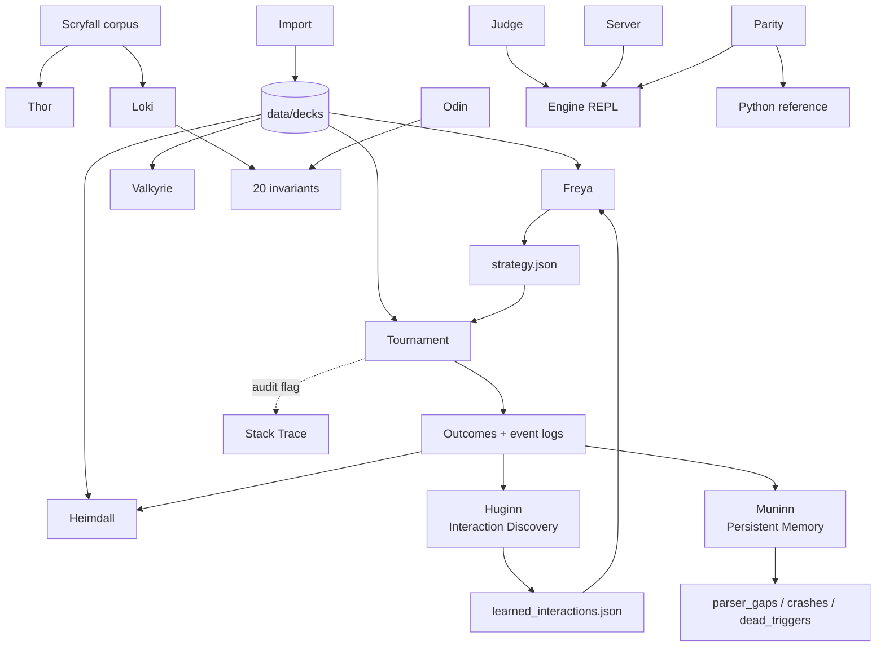

# HexDek Tool Suite — Norse Pantheon

> Last updated: 2026-04-30
> Location: `cmd/`

Norse-named tool suite around the [HexDek engine](Engine%20Architecture.md). Each tool is a single-binary entry point under `cmd/`; shared engine logic lives in `internal/`. Tools split testing, simulation, analysis, and serving into separate processes so each can be parallelized independently and run overnight on DARKSTAR.

## Tools

| Tool | Purpose | Binary | Status |
|---|---|---|---|
| Thor | Per-card stress tester (oracle-text-aware effect verification) | `cmd/hexdek-thor/` | **Active** — Thor 2.0 in progress |
| Odin | 20-invariant predicate definitions | `cmd/hexdek-odin/` | Active (infrastructure) |
| ~~Loki~~ | ~~Random-deck chaos gauntlet + nightmare boards~~ | `cmd/hexdek-loki/` | **Legacy** — superseded by Feynman + fishtank |
| Heimdall | Spectator + post-game analytics, seed ring buffer | `cmd/hexdek-heimdall/` | Active |
| Freya | Static deck analyzer, archetype + win lines, drives StrategyProfile | `cmd/hexdek-freya/` | Active |
| Valkyrie | Deck regression runner over `data/decks/` | `cmd/hexdek-valkyrie/` | Active |
| Judge | Interactive REPL for adversarial rules testing | `cmd/hexdek-judge/` | Active |
| Tournament | Parallel tournament runner (workhorse) | `cmd/hexdek-tournament/` | Active |
| Server | WebSocket game server for `hexdek.dev` | `cmd/hexdek-server/` | Active |
| Import | Single Moxfield/Archidekt URL → `.txt` deck | `cmd/hexdek-import/` | Active |
| Huginn | Emergent interaction discovery (co-trigger → pattern → tier graduation) | `cmd/hexdek-huginn/` | Active |
| Muninn | Persistent crash/gap/dead-trigger memory (append-only telemetry) | `cmd/hexdek-muninn/` | Active |
| ~~Parity~~ | ~~Go ↔ Python engine parity verifier~~ | `cmd/hexdek-parity/` | **Legacy** — GreedyHat→Yggdrasil migration complete |
| Stack Trace | CR-compliance audit logger (in-engine, not a binary) | `internal/gameengine/stack_trace.go` | Active |

## How They Fit Together



- [Thor](Tool%20-%20Thor.md) verifies cards in isolation — Thor 2.0 adds action traces, opponent auto-detect, conditional scaffolding, and oracle errata sync
- [Odin](Invariants%20Odin.md) defines the 20 invariant predicates used by Feynman at runtime
- ~~[Loki](Tool%20-%20Loki.md)~~ retired 2026-05-06 — random-composition testing superseded by fishtank + Feynman + Muninn observability stack
- [Freya](Tool%20-%20Freya.md) writes `strategy.json` consumed by [YggdrasilHat](YggdrasilHat.md) inside [Tournament](Tool%20-%20Tournament.md)
- [Heimdall](Tool%20-%20Heimdall.md) reads tournament event logs for analytics + missed-combo detection + seed ring buffer for anti-cheat
- [Valkyrie](Tool%20-%20Valkyrie.md) is the regression smoke test against the curated portfolio
- [Judge](Tool%20-%20Judge.md) reproduces bugs Thor/Valkyrie surface in a controlled REPL
- [Server](Tool%20-%20Server.md) hosts the live web frontend at hexdek.dev
- [Import](Tool%20-%20Import.md) feeds `data/decks/`; [Moxfield Import Pipeline](Moxfield%20Import%20Pipeline.md) handles bulk corpus pulls
- [Huginn](Tool%20-%20Huginn.md) discovers emergent card interactions from Heimdall's co-trigger data, graduates them through 3 confidence tiers, feeds confirmed patterns to Freya
- [Muninn](Tool%20-%20Muninn.md) accumulates parser gaps, crash logs, and dead triggers across tournament runs as append-only persistent memory
- ~~[Parity](Tool%20-%20Parity.md)~~ retired — GreedyHat→Yggdrasil migration is complete, Python reference engine no longer maintained

## Verification Status

```
Thor:     793,826 tests across 36,083 cards — ZERO failures
Feynman:  20 Odin invariants checked every action in EVERY live game (replaced Loki)
Muninn:   Persistent gap/crash memory across all tournament runs
CR Audit: 15/15 identified issues FIXED
```

## Legacy Tools

| Tool | Retired | Reason |
|---|---|---|
| Loki | 2026-05-06 | Fishtank (24/7 random pods) + Feynman (runtime invariants) + Muninn (crash memory) cover all of Loki's functions with full diagnostic context. Loki found violations but couldn't explain them — no traces, no event chain, no telemetry. |
| Parity | 2026-05-06 | Built to verify Go engine matched the Python reference during migration. Migration complete, Python engine no longer maintained. |

## Related

- [Engine Overview](Engine%20Overview.md)
- [Engine Architecture](Engine%20Architecture.md)
- [Tournament Runner](Tournament%20Runner.md)
- [Hat AI System](Hat%20AI%20System.md)
